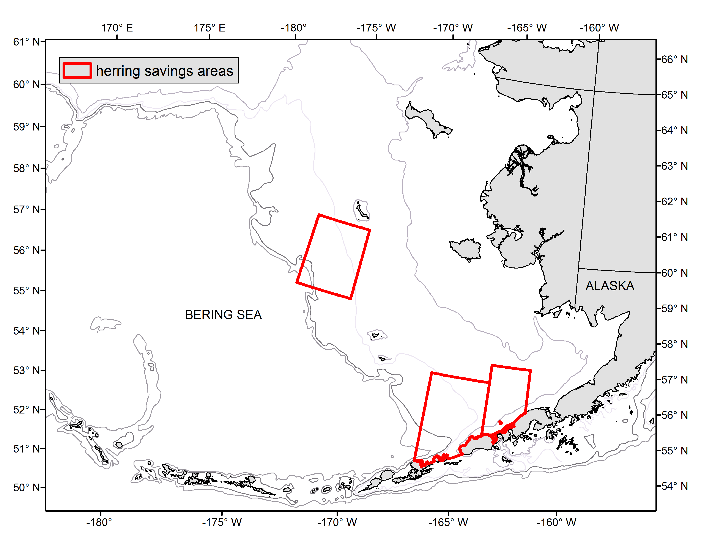
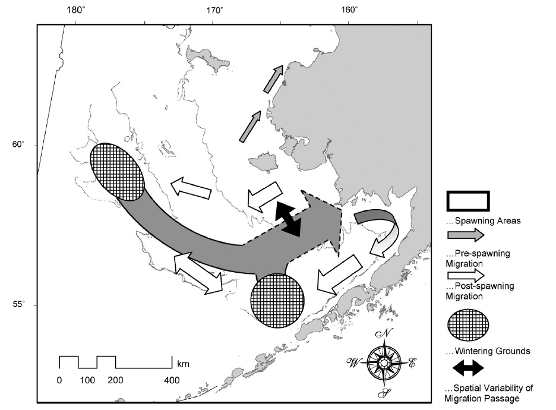

\newpage

```{r,echo=F,message=FALSE,warning=F, include=F}
library(knitr)
library(ggplot2)
library(PBSmodelling)
library(pander)
library(coda)
library(maps)
library(lattice)
library(PBSmapping)
library(mapdata)    #some additional hires data
library(maptools)   #useful tools such as reading shapefiles
library(mapproj)
library(plotrix)
library(RColorBrewer)
library(miceadds)
library(ggplot2)
library(dplyr)
library(reshape2)

#==make it so the big figures are plotted once and then not again (e.g. survey results)

```

# Bering Sea and Aleutian Islands 

ADD SUMMARY HERE

\newpage

# B. Trends in density, prevalence, and distribution
## Information content of data sources
The primary data source for this report is the bottom trawl survey, but this survey is not aimed at sampling the water column (where many forage species reside) and is not designed to capture small fish. Consequently, measures of density, prevalence, and distribution are uncertain. The goal of this report is to present the data from the bottom trawl survey for forage species while understanding the potential shortcomings of the survey for this task. The BASIS survey samples surface waters and presumably samples pelagic forage species better than the bottom trawl, but it has not been performed as long so does not provide the contrast the bottom trawl might.

## Methods
### NMFS bottom trawl surveys
For most of this section, data are from bottom trawl surveys conducted by the AFSC on the EBS shelf (annual), the EBS slope (biennial) and in the AI (biennial; methods and data at: http://www.afsc.noaa.gov/RACE/groundfish/default.php). The standardized EBS shelf survey began in 1982 but some work using similar gear was conducted prior to 1982; the EBS slope and AI surveys have occurred biennially since the early 2000s. These surveys are conducted from May to August. The survey was expanded to the north in 1987, so densities and prevalence before 1988 should be considered with this in mind. In 2010, the AFSC began to conduct an additional survey to the north of the 1987 survey area, comprising all waters south of Bering Strait including Norton Sound. Due to the loss of seasonal sea ice and corresponding changes in fish distribution this northern survey is conducted regularly as of 2017 and will likely be increasingly important in ecosystem understanding.

Surface trawl surveys are also conducted by the AFSC Ecosystem Monitoring and Assessment (EMA) program (Yasumiishi et al. 2017). This survey has been conducted every year since 2003, although the extent and density of stations sampled has varied among years. The abundance index derived from this survey for forage species is a standardized geostatistical index (VAST) developed by Thorson et al. (2015) to estimate indices of abundance for stock assessments. The survey occurs primarily in September, with sampling during August and October in some years.

### BASIS surveys
Annual indices of juvenile groundfish, juvenile salmon, forage fish, and jellyfish biomass (metric tonnes) and abundance (numbers) of juvenile sockeye salmon (*O. nerka*) in surface waters were estimated for the Alaska Fisheries Science Centers’ (AFSC) Bering Arctic Subarctic Integrated Survey (BASIS). BASIS is an integrated fisheries oceanography survey in the south- and northeastern Bering Sea during late summer, 2003-2023. Primary fish caught include age-0 Pacific cod (*Gadus macrocephalus*), age-0 pollock (*Gadus chalcogrammus*), capelin (*Mallotus villosus*), Pacific herring (*Clupea pallasii*), juvenile Chinook salmon (*Oncorhynchus tshawytscha*), juvenile sockeye (*O. nerka*), juvenile chum salmon (*O. keta*), juvenile pink salmon (*O. gorbuscha*), juvenile coho salmon (*O. kisutch*), and saffron cod (*Eleginus gracilis*), also used as the index for total forage fish. 

Pelagic fish were sampled using a trawl net towed in the upper 25 m. For the estimates of species abundance, the BASIS survey (373,404 km2) was south to north from 54.54° to 59.50° west to east from -173.08° to -159.00° for years 2002-2012, 2014, 2016, 2018, and 2022. The northern Bering Sea survey (197,868 km2) was within the region south to north from 59.97° to 65.50° west to east from -172.00° to -161.50° for years 2003-2007, 2009-2019, 2021-2023. A trawl was towed for approximately 30 minutes. Area swept was estimated from horizontal net opening and distance towed. Next year, authors plan to present density rather than biomass and abundance estimates to account for differences in survey area in the north and south 

Annual indices of relative biomass and numbers (abundance) were estimated using a single-species spatio-temporal model with the VAST package version 3.10.1, INLA version 22.04.16, TMB version 1.9.2, FishStatsUtils version 2.12.1, R software version 4.11.3, and RStudio version 2023.06.1 (R Core Team 2023, Thorson 2015; Thorson and Kristensen 2016, Thorson 2019). We used the VAST package to reduce bias in biomass estimates due to spatially unbalanced sampling across years, while propagating uncertainty resulting from predicting density in unsampled areas. Spatial and spatio-temporal variation for both encounter probability and positive catch rate components were specified at a spatial resolution of 500 knots. We used a Poisson-link, or conventional, delta model and a gamma distribution to model positive catch rates and specified a bias-corrected estimate (Thorson 2019). Parameter estimates were within the upper and lower bounds and final gradients were less than 0.0005. Julian day was added as a normalized covariate with a spatially constant and linear response due to changes in the timing of the survey among years. Time series estimates of capelin and herring abundance changed due to a change in model specification in 2023 from a log normal to gamma distribution for positive catch rates.

## Pacific capelin

Capelin are distributed primarily in the inner domain of the EBS shelf (\autoref{capelin_time_map}). The pattern of CPUE varies substantially between the surface and bottom trawl surveys, with catches in the BASIS survey occurring further north than in the EBS trawl survey (Yasumiishi et al. 2017). The reason for these differences is not clear. In the bottom trawl survey, biomass estimates are variable but there also appear to be decadal signals in density (\autoref{capelin}).  Recent densities and prevalence in the bottom trawl survey were near or at all-time lows (\autoref{capelin}). 


## Eulachon

Eulachon tend to occur deeper in the water column and are more likely to be associated with the bottom than other forage species. As a result the bottom trawl surveys sample eulachon more effectively than other forage species, and eulachon are essentially absent from the BASIS surface trawls. Eulachon are consistently distributed in the extreme southern portion of the outer EBS shelf (\autoref{eulachon_time_map}). Decadal signals also appear in survey density estimates for eulachon (\autoref{eulachon}). Recent densities and prevalence for eulachon in the bottom trawl survey were at or near all-time lows (\autoref{eulachon}). 

## Rainbow smelt

Rainbow smelt are rare in the bottom trawl survey, unless the northern Bering Sea (NBS) data are included (\autoref{rainbow_time_map}). The highest abundance of rainbow smelt is in the NBS and particularly Norton Sound (\autoref{rainbow}). Rainbow smelt are often found in shallow nearshore waters, so this apparent distribution may not be fully representative. For example, nearshore studies in northern Bristol Bay (Nushagak and Togiak bays) captured large number of rainbow smelt in multiple size classes (Ormseth, unpublished data). Prevalence and densities in the bottom trawl survey depend strongly on whether or not the NBS is sampled (\autoref{rainbow}).

## Pacific sand lance

Sand lances are difficult to sample due to their patchiness and behavior, which entails spending much of their time burrowed into sand. As a result, information for Pacific sand lance in the BSAI is limited. The bottom trawl survey suggests that they have a primarily inshore distribution in the EBS, particularly in areas with extensive sandy bottom substrates (\autoref{sandlance_time_map}). They also occur in the AI, particularly in the islands west of Amchitka Pass (\autoref{sandlance_time_map}). Densities and prevalence of sand lance have risen since all-time lows in 2016, to approximately the long-term average in 2024 (\autoref{sandlance}).

## Pacific sandfish
Similar to sand lance, sandfishes burrow into sandy substrates. This is reflected in their distribution which is centered in the shallow inshore waters of the EBS, in Bristol Bay and along the northern shore of the Alaska Peninsula (\autoref{sandfish_time_map}). The BASIS surveys suggest a similar distribution (Yasumiishi et al. 2017). Unlike most of the other forage species, neither survey has found them north of Cape Romanzof (61°47’ N), so this is likely the northern extent of their range. This is confirmed by historical reports (Mecklenburg et al. 2002). Densities and prevalence of sandfish have been beneath long-term averages for the last decade, but prevalence has been trending upward over the last 4 years (\autoref{sandfish}). 

## Lanternfishes
Myctophids are generally deep-water fishes (> 200 m depth), although diel migrations can bring them into surface waters. This is consistent with their distribution observed in BSAI survey data, where they occur on the EBS slope and along the shelf break and slope in the AI (\autoref{myctophid_time_map}). 

## Pricklebacks, gunnels, blacksmelts, bristlemouths, eelblennies
These species occur infrequently in the AFSC surveys, either due to their small size or their preference for unsurveyed habitats (e.g. nearshore areas or deep pelagic waters). Several species of pricklebacks and eelblennies are observed in the bottom trawl surveys and are combined here to present more complete picture of their distributions and abundance. Pricklebacks and eelblennies appear to be more prevalent in the northern Bering Sea (\autoref{prickleback_time_map} & \autoref{eelblenny_time_map}). Prevalence and density of both pricklebacks and eeblennies are low outside of the NBS (\autoref{prickleback} & \autoref{eelblenny}).

## Pacific herring
The spatial distribution of herring in the BSAI described by the bottom trawl survey and the BASIS survey differ and may result from seasonal herring movement. The bottom trawl survey occurs primarily in June and July and is likely capturing herring that are out-migrating from nearshore spawning areas; the areas of high CPUEs on the southern edge of the EBS and around Nunivak Island (\autoref{herring_time_map}) are consistent with the movement patterns in (\autoref{herring_mig}). Herring density estimates and prevalence display high interannual variability with less of a decadal signal than other forage species and are both above the long-term mean over this biennial cycle (\autoref{herring}). 

## Squid
Magistrate armhook squid (*Berryteuthis magister*) are regularly encountered by the Aleutian Islands bottom trawl survey because of their relatively large size (\autoref{squid_time_map}; maximum mantle length of ~28 cm, Sealifebase.com). Smaller species and juvenile squid are mainly found near surface waters. Density and prevalence are strongly related to whether or not the Aleutian Islands are sampled (\autoref{squid}). Recent densities are up slightly from values observed in 2000s, but prevalence has not markedly increased (\autoref{squid}). 

## Shrimp
Observations of several shrimps are reported in the bottom trawl survey, including: unidentified pandalid shrimp, ocean shrimp, Alaska pink shrimp, sculptured shrimp, skeleton shrimp, coonstrip shrimp, humpy shrimp, opossum shrimp, Greenland shrimp, Aleutian coastal shrimp, sidestripe shrimp, and seven spine bay shrimp (among others). For this report, all shrimp were lumped together to represent the Bering Sea wide dynamics of shrimp.  The highest densities of shrimp are consistently in the outer domain in deep waters (\autoref{shrimp_time_map}). Average densities have trended upwards since the 1980s and prevalence peaked in the late-2000s (\autoref{shrimp}).

## BASIS forage index
During 2023, the biomass of forage fishes was low in pelagic waters of the northeastern Bering Sea during late summer, but increased slightly from 2022 (\autoref{basis}). Temporal trends in forage fish biomass indicated higher productivity during the recent warm years (2014-2018) and lower during the cold years (2007-2013), especially for the southern forage fish. In the southern region, the trends in biomass were dominated by age-0 pollock (2004, 2005) and juvenile sockeye salmon (2014-2018) in the south and herring (2014-2019) in the northern region. 

# C. Bycatch and other conservation issues
## FMP forage group
Osmerids regularly make up the vast majority of FMP forage fish group catches (\autoref{fmp_incid_cat}). Eulachon are the most abundant osmerid catch and it is likely that they make up the majority of the 'other osmerid' catch. Osmerid catches (and consequently total FMP forage group catches) have been low relative to historical levels (\autoref{fmp_incid_cat}). Other osmerids and shrimp accounted for almost all of the incidental catch in 2023. Squid catches since 2019 have been twice the historical maximums (\autoref{squid_catch}). 

## Pacific herring
The Prohibited Species Catch (PSC) of herring is generally low, with occasional larger catches (e.g. 1991, 2004, 2012, and 2020; \autoref{ebs_herring_catch}). Herring PSC in 2024 was slightly above the long-term mean. Most of the herring bycatch occurs in the midwater trawls for walleye pollock in the BSAI (\autoref{ebs_herring_catch}).


\newpage

```{r,echo=FALSE,warning=FALSE,message=F}

dattab<-read.csv("data/BSAI/list of species.csv")

pander(dattab[,1:2],justify=c("left"),caption="\\label{speciestable}A list of species designated as forage species in Alaska.")

```


\newpage

```{r,echo=FALSE,warning=FALSE,message=F,out.width="95%",fig.cap="\\label{herring_ground}Locations of Pacific herring fisheries in the Bering Sea/Aleutian Islands region (yellow dots) and Herring Savings Areas (red-outlined polygons). The two largest herring fisheries are labeled by name; the larger dot at Togiak indicates that this is by far the biggest fishery."}



```


\newpage

```{r,echo=FALSE,warning=FALSE,message=F,out.width="95%",fig.cap="\\label{herring_mig}Hypothesized migration routes and seasonal distributions of Pacific herring in the eastern Bering Sea. Figure is from Tojo et al. 2007."}



```

\newpage

```{r,echo=FALSE,warning=FALSE,message=F,out.width="95%",fig.cap="\\label{capelin_time_map}Map of distribution of prevalence and density from the all BSAI surveys for Pacific capelin (zoom for detail)."}

include_graphics("plots/ebs_time_map_Pacific capelin.png")

```


\newpage


```{r,echo=FALSE,warning=FALSE,message=F,out.width="95%",fig.cap="\\label{capelin}Pacific capelin survey data. Spatial density in BSAI surveys (a), spatial densities in the previous four years for which survey data was available (b), prevalence in terms of the number of survey stations that returned positive tows for this species (c), and average densities split by survey location in the BSAI (d)."}

include_graphics("plots/ebs_Pacific capelin.png")

```


\newpage

```{r,echo=FALSE,warning=FALSE,message=F,out.width="95%",fig.cap="\\label{eulachon_time_map}Map of distribution of prevalence and density from the all BSAI surveys for eulachon (zoom for detail)."}

include_graphics("plots/ebs_time_map_eulachon.png")

```


\newpage


```{r,echo=FALSE,warning=FALSE,message=F,out.width="95%",fig.cap="\\label{eulachon}Eulachon survey data. Spatial density in BSAI surveys (a), spatial densities in the previous four years for which survey data was available (b), prevalence in terms of the number of survey stations that returned positive tows for this species (c), and average densities split by survey location in the BSAI (d)."}

include_graphics("plots/ebs_eulachon.png")

```


\newpage


```{r,echo=FALSE,warning=FALSE,message=F,out.width="95%",fig.cap="\\label{rainbow_time_map}Map of distribution of prevalence and density from the all BSAI surveys for rainbow smelt(zoom for detail)."}

include_graphics("plots/ebs_time_map_rainbow smelt.png")

```


\newpage

```{r,echo=FALSE,warning=FALSE,message=F,out.width="95%",fig.cap="\\label{rainbow}Rainbow smelt survey data. Spatial density in BSAI surveys (a), spatial densities in the previous four years for which survey data was available (b), prevalence in terms of the number of survey stations that returned positive tows for this species (c), and average densities split by survey location in the BSAI (d)."}

include_graphics("plots/ebs_rainbow smelt.png")

```


\newpage

```{r,echo=FALSE,warning=FALSE,message=F,out.width="95%",fig.cap="\\label{sandlance_time_map}Map of distribution of prevalence and density from the all BSAI surveys for rainbow smelt(zoom for detail)."}

include_graphics("plots/ebs_time_map_sand lance unid..png")

```

\newpage

```{r,echo=FALSE,warning=FALSE,message=F,out.width="95%",fig.cap="\\label{sandlance}Pacific sand lance survey data. Spatial density in BSAI surveys (a), spatial densities in the previous four years for which survey data was available (b), prevalence in terms of the number of survey stations that returned positive tows for this species (c), and average densities split by survey location in the BSAI (d)."}

include_graphics("plots/ebs_sand lance unid..png")

```


\newpage


```{r,echo=FALSE,warning=FALSE,message=F,out.width="95%",fig.cap="\\label{sandfish_time_map}Map of distribution of prevalence and density from the all BSAI surveys for Pacific sandfish(zoom for detail)."}

include_graphics("plots/ebs_time_map_Pacific sandfish.png")

```

\newpage

```{r,echo=FALSE,warning=FALSE,message=F,out.width="95%",fig.cap="\\label{sandfish}Pacific sandfish survey data. Spatial density in BSAI surveys (a), spatial densities in the previous four years for which survey data was available (b), prevalence in terms of the number of survey stations that returned positive tows for this species (c), and average densities split by survey location in the BSAI (d)."}

include_graphics("plots/ebs_Pacific sandfish.png")

```


\newpage


```{r,echo=FALSE,warning=FALSE,message=F,out.width="95%",fig.cap="\\label{myctophid_time_map}Map of distribution of prevalence and density from the all BSAI surveys for Pacific mytophids (zoom for detail)."}

include_graphics("plots/ebs_time_map_myctophid.png")

```

\newpage

```{r,echo=FALSE,warning=FALSE,message=F,out.width="95%",fig.cap="\\label{prickleback_time_map}Map of distribution of prevalence and density from the all BSAI surveys for pricklebacks (zoom for detail)."}

include_graphics("plots/ebs_time_map_prickleback.png")

```

\newpage

```{r,echo=FALSE,warning=FALSE,message=F,out.width="95%",fig.cap="\\label{prickleback}Prickleback survey data. Spatial density in BSAI surveys (a), spatial densities in the previous four years for which survey data was available (b), prevalence in terms of the number of survey stations that returned positive tows for this species (c), and average densities split by survey location in the BSAI (d)."}

include_graphics("plots/ebs_prickleback.png")

```


\newpage

```{r,echo=FALSE,warning=FALSE,message=F,out.width="95%",fig.cap="\\label{eelblenny_time_map}Map of distribution of prevalence and density from the all BSAI surveys for eelblennies (zoom for detail)."}

include_graphics("plots/ebs_time_map_eelblenny.png")

```

\newpage

```{r,echo=FALSE,warning=FALSE,message=F,out.width="95%",fig.cap="\\label{eelblenny}Eelblenny survey data. Spatial density in BSAI surveys (a), spatial densities in the previous four years for which survey data was available (b), prevalence in terms of the number of survey stations that returned positive tows for this species (c), and average densities split by survey location in the BSAI (d)."}

include_graphics("plots/ebs_eelblenny.png")

```


\newpage


```{r,echo=FALSE,warning=FALSE,message=F,out.width="95%",fig.cap="\\label{herring_time_map}Map of distribution of prevalence and density from the all BSAI surveys for Pacific herring (zoom for detail)."}

include_graphics("plots/ebs_time_map_Pacific herring.png")

```


\newpage


```{r,echo=FALSE,warning=FALSE,message=F,out.width="95%",fig.cap="\\label{herring}Pacific herring survey data. Spatial density in BSAI surveys (a), spatial densities in the previous four years for which survey data was available (b), prevalence in terms of the number of survey stations that returned positive tows for this species (c), and average densities split by survey location in the BSAI (d)."}

include_graphics("plots/ebs_Pacific herring.png")

```


\newpage


```{r,echo=FALSE,warning=FALSE,message=F,out.width="95%",fig.cap="\\label{squid_time_map}Map of distribution of prevalence and density from the all BSAI surveys for squid (zoom for detail)."}

include_graphics("plots/ebs_time_map_magistrate armhook squid.png")

```

\newpage


```{r,echo=FALSE,warning=FALSE,message=F,out.width="95%",fig.cap="\\label{squid}Squid survey data. Spatial density in BSAI surveys (a), spatial densities in the previous four years for which survey data was available (b), prevalence in terms of the number of survey stations that returned positive tows for this species (c), and average densities split by survey location in the BSAI (d)."}

include_graphics("plots/ebs_magistrate armhook squid.png")

```


\newpage

```{r,echo=FALSE,warning=FALSE,message=F,out.width="95%",fig.cap="\\label{shrimp_time_map}Map of distribution of prevalence and density from the all BSAI surveys for shrimp (zoom for detail)."}

include_graphics("plots/ebs_time_map_shrimp.png")

```

\newpage

```{r,echo=FALSE,warning=FALSE,message=F,out.width="95%",fig.cap="\\label{shrimp}Shrimp survey data. Spatial density in BSAI surveys (a), spatial densities in the previous four years for which survey data was available (b), prevalence in terms of the number of survey stations that returned positive tows for this species (c), and average densities split by survey location in the BSAI (d)."}

include_graphics("plots/ebs_shrimp.png")

```

\newpage


```{r,echo=FALSE,warning=FALSE,message=F,out.width="95%",fig.cap="\\label{basis}Index of forage abundance developed based on the BASIS surface trawls."}

include_graphics("plots/basis.png")

```

\newpage

```{r,echo=FALSE,warning=FALSE,message=F,out.width="95%",fig.cap="\\label{fmp_incid_cat}Incidental catches of fishes in the BSAI FMP forage group (2003-2023)."}

include_graphics("plots/ebs_non_target_catch.png")

```

\newpage

```{r,echo=FALSE,warning=FALSE,message=F,out.width="95%",fig.cap="\\label{fmp_incid_cat_ind}Incidental catches of fishes in the BSAI FMP forage group (2003-2023)."}

include_graphics("plots/ebs_non_target_catch_ind.png")

```

\newpage


```{r,echo=FALSE,warning=FALSE,message=F,out.width="95%",fig.cap="\\label{squid_catch}Catches of squid in the BSAI. "}

include_graphics("plots/ebs_squid_catch.png")

```

\newpage


```{r,echo=FALSE,warning=FALSE,message=F,out.width="95%",fig.cap="\\label{ebs_herring_catch}Catches of Pacific herring in the BSAI. "}

include_graphics("plots/ebs_herring_catch.png")

```

\newpage


